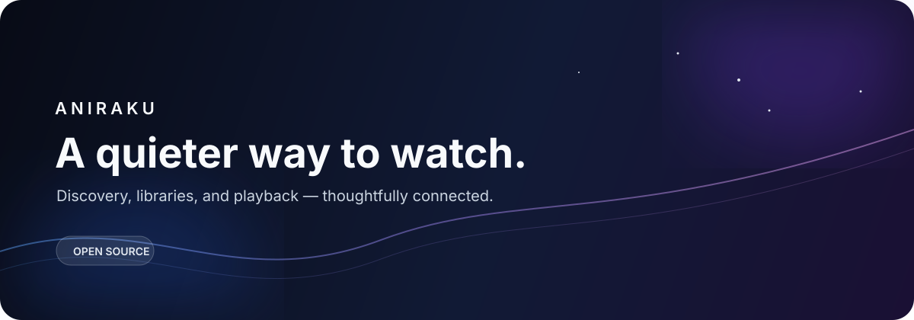

<p align="center">
  
</p>

<p align="center">
  <a href="https://www.aniraku.tech/"></a>
  <a href="https://github.com/Aniraku/Aniraku"></a>
  <a href="https://aniraku.github.io/Aniraku-App/"></a>
  <a href="https://discord.gg/aniraku"></a>
</p>


## The idea

Aniraku is an open-source anime experience built around **less noise and more continuity**. Find something worth watching, keep your library close, and move from discovery to playback without losing the thread.

```text
one product
 two repositories
  a calmer path from search to screen
```

## The showcase

### Aniraku / Frontend

<p><strong>The visible surface.</strong><br/>A React and Vite experience for discovery, schedules, profiles, libraries, watch history, and focused playback.</p>

<p>
  <a href="https://github.com/Aniraku/Aniraku"></a>
  <a href="https://github.com/Aniraku/Aniraku/network/members"></a>
  
</p>

### Aniraku / Backend

<p><strong>The quiet engine.</strong><br/>A Go service for API access, Supabase authentication, AniList metadata, provider coordination, network safety, and normalized edges.</p>

<p>
  <a href="https://github.com/Aniraku/Aniraku-Backend"></a>
  <a href="https://github.com/Aniraku/Aniraku-Backend/blob/main/CONTRIBUTING.md"></a>
</p>

### Aniraku / Native Android

<p><strong>v2.6 is the current stable direct-distribution release.</strong><br/>The Expo and React Native client brings Aniraku discovery, source-aware native playback, website-provider parity, replay-safe rebuffer recovery, resilient public Downloads-folder saves for eligible direct sources, guarded embedded-player navigation, and the same protected AniList/MyAnimeList library-sync route used by aniraku.tech to Android 9+ devices.</p>

<p>
  <a href="https://aniraku.github.io/Aniraku-App/"></a>
  <a href="https://github.com/Aniraku/Aniraku-App/releases/tag/v2.6"></a>
  <a href="https://rookieenough.github.io/Orion-Data/redirect.html?id=aniraku"></a>
</p>

> **Package:** `aniraku.anime.app` · **Compatibility:** Android 9+ (API 28+) · ARM32 + ARM64 · **Install:** direct APK, without Google Play.

<p><a href="https://github.com/Aniraku/Aniraku-App"><strong>Explore the Android source and downloads →</strong></a></p>


## Architecture

```text
┌────────────────────────────┐
│ React + Vite · Native App  │
│   discover · save · watch  │
└──────────────┬─────────────┘
               │
┌──────────────▼─────────────┐
│        Go API service      │
│ auth · metadata · routing  │
└───────┬─────────┬──────────┘
        │         │
   AniList    providers
              Miruro · Senshi
```

## Stack constellation

<p>
  
  
  
  
  
  
</p>

## Organization pulse

<p align="center">
  
</p>

<p align="center">
  
</p>

## Contribute to the atmosphere

Good contributions arrive with context, clear boundaries, and respect for the project’s users and upstream services. Start with the repository-specific contribution guide, keep secrets out of commits, and use private disclosure for security concerns.

<p>
  <a href="https://github.com/Aniraku/Aniraku/issues"></a>
  <a href="https://github.com/Aniraku"></a>
</p>

<p align="center"><sub>Built openly by the Aniraku community. Please respect applicable content rights and service terms.</sub></p>
